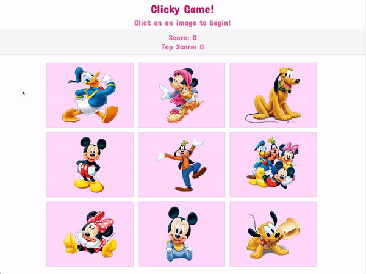

# clicky-game

Memory game using React: Users click on images to earn points, but cannot click on any more than once. The application renders different images to the screen and listens for click events. The app keeps track of the user's score: Incremented when clicking an image for the first time, reset to 0 if user clicks the same image more than once. Every time an image is click, the images rendered to the page shuffle themselves in a random order. Once the user's score is reset after an incorrect guess, the game restarts.

GITHUB PAGES & REACT DEPLOYMENT: https://ymegan08.github.io/clicky-game/;

You can find the github page for this project in the gh-pages branch.

## DEMO OF APP

